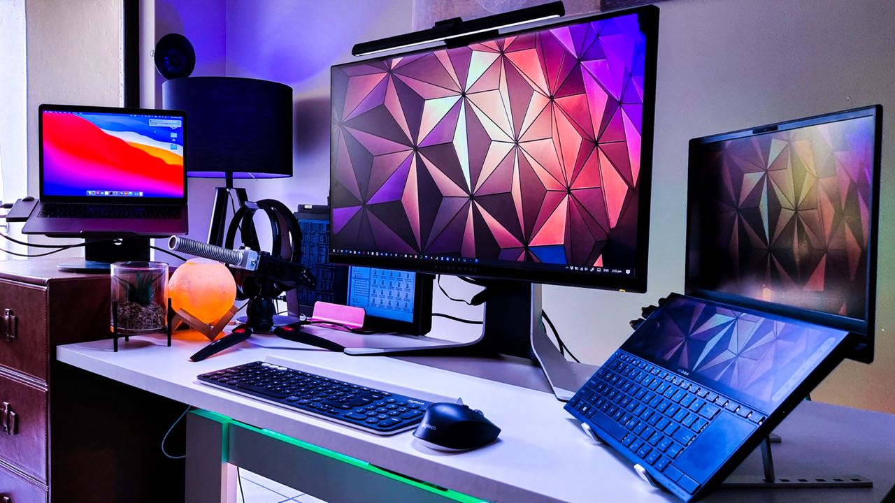
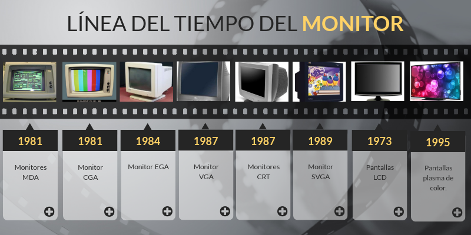

# 🖥️ **MONITOR**

> "Welcome to the world of monitors: from their historical evolution to the latest technologies and trends in display screens."

## 🎯Goals

The main goal of this repository is to provide a comprehensive and detailed resource on monitors, addressing the following key aspects:
- **Definition**
- **Guys**
- **Characteristics**
- **Aspects to Consider When Buying a Monitor**

## Index

## 📜 **Brief History**

Monitors, also known as displays, emerged in the 1950s with cathode ray tube (CRT) technology. In 1981, IBM introduced MDA monochrome monitors and CGA color monitors. The evolution continued with the VGA standard in 1987, which ushered in the era of high-resolution graphics.

🔍 [Definition](#definition)

💻 [Types of Monitors](#types-of-monitors)

⚙️ [Main Features](#main-features)

🖥️ [Screen Technologies](#screen-technologies)

🌐 [Commercial Examples](#commercial-examples)

🔍 [Conclusions](#conclusions)
 
## AUTHORS

* :pushpin: [Álvarez Padilla, David Manuel](https://github.com/DavidPadilla24)
* :pushpin: [Cabezuelo Expósito, Adrián](https://github.com/AdrianCE94)
* :pushpin: [David Sánchez Caicedo](https://github.com/davidlinesc)

 ## LICENSE

 
This work is licensed under <a href="http://creativecommons.org/licenses/by-sa/4.0/?ref=chooser- v1" target="_blank" rel="license noopener noreferrer" style="display:inline-block;">Attribution-ShareAlike 4.0 International</a>

 Read this repository / Change Language
- [🇪🇸 Spanish](README.md)
- [🇬🇧 English](README_EN.md)
