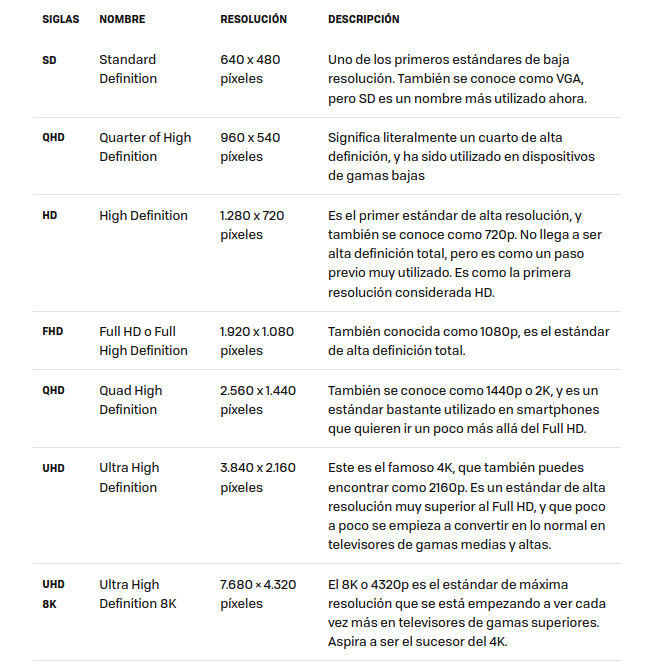
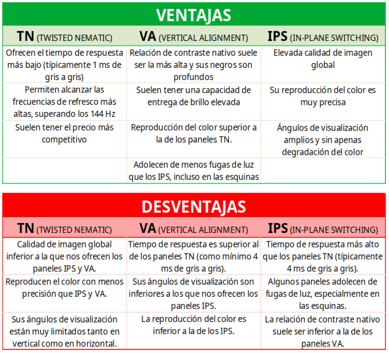
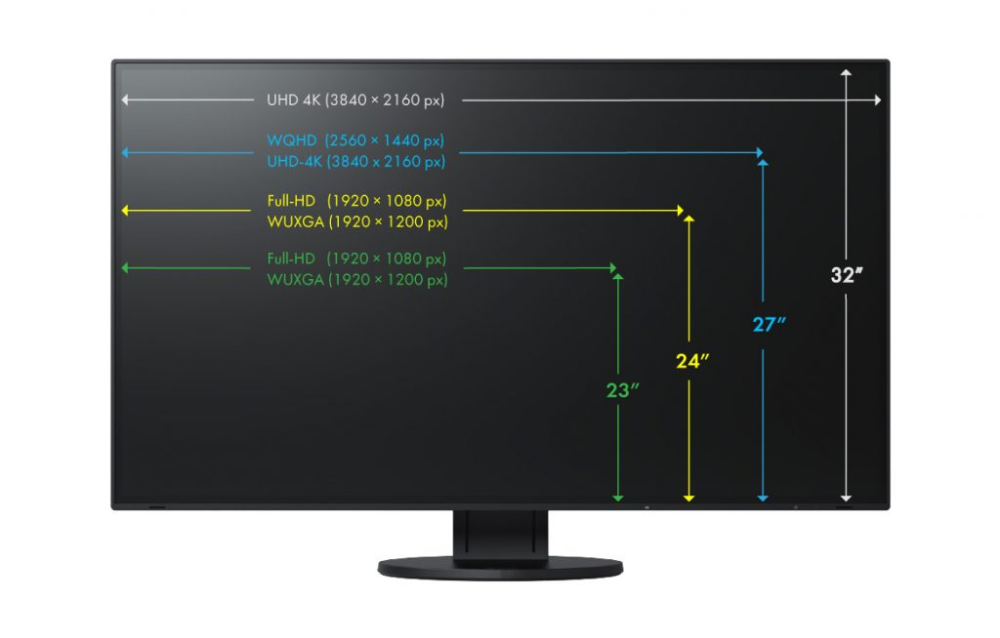
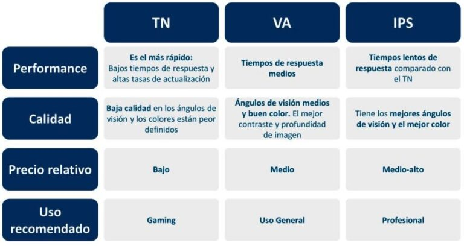
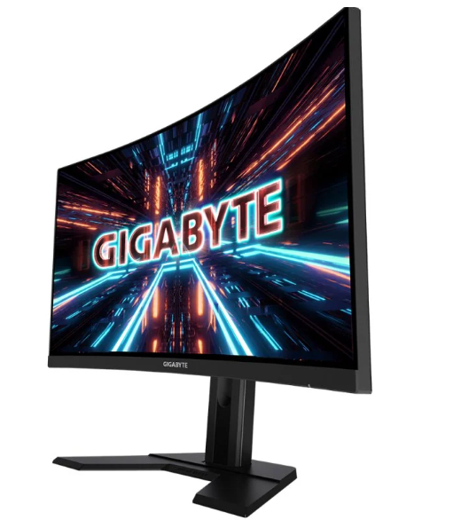
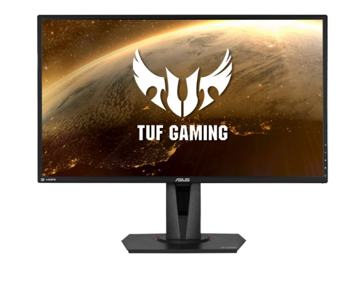
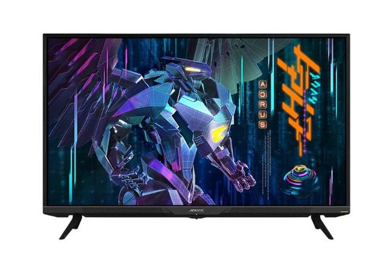
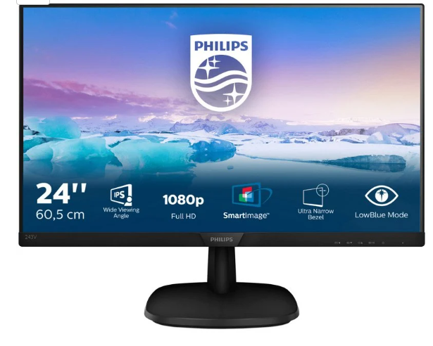

## ANTES DE ELEGIR UN MONITOR

A la hora de elegir un monitor, es importante considerar varios aspectos para garantizar una experiencia de visualización óptima.Cabe destacar que la maquina que vayas a usar para utilizar el monitor debe ir acorde a la gama de pantalla que elijas

>ejemplo : si compro un monitor 4k pero tengo un pc poco potente, no vamos a sacar el maximo partido a nuestro monitor.
## ASPECTOS A TENER EN CUENTA 
>RES

>TIPO PANEL

>TASA REFRESCO

| Tasa de Refresco | Descripción                                   |
|------------------|-----------------------------------------------|
| 60Hz             | Estándar común, adecuado para tareas generales|
| 75Hz             | Mayor suavidad en la visualización            |
| 120Hz            | Mejora significativa en juegos y contenido multimedia |
| 144Hz            | Experiencia de juego ultra fluida             |
| 240Hz            | Ideal para juegos de alta velocidad y competición |

>TAMAÑO

## Ejemplos destacados de monitores para cada necesidad:

 
 💻 **Para PC Gaming:**

- **Resolución:** Mínimo 1920x1080 (Full HD), preferiblemente 2560x1440 (Quad HD) o 3840x2160 (Ultra HD / 4K).
  
- **Tasa de Refresco:** Mínimo 144Hz para una experiencia fluida, preferiblemente 240Hz o más para juegos de ritmo rápido.
  
- **Tiempo de Respuesta:**  1ms o 2ms para evitar el desenfoque de movimiento en juegos intensos.

  1)[Gigabyte G27QC 27" LED QuadHD 165Hz Curva](https://www.pccomponentes.com/gigabyte-g27qc-27-led-quadhd-165hz-curva)

  2)[ASUS TUF Gaming VG27AQZ 27" LED IPS WQHD 165Hz G-Sync Compatible](https://www.pccomponentes.com/asus-tuf-gaming-vg27aqz-27-led-ips-wqhd-165hz-g-sync-compatible)

  
🎮 **Por Consola(General):**

- **Tamaño:** 16:9
- **Frecuencia:** 60-144 Hz
- **Tecnologías:** FreeSync (AMD)
- **Tiempo de respuesta(tiempo en reaccionar un pixel) e input lag(tiempo en reaccionar el monitor cuando entra la imagen)**

- 🎮PS5 
  - **Tecnología de Sincronización:** Compatible con HDMI 2.1 para aprovechar al máximo las capacidades de la PS5, incluida la compatibilidad con 4K a 120Hz y la tecnología de sincronización variable (VRR).

  [GIGABYTE AORUS](https://www.pccomponentes.com/gigabyte-aorus-fv43u-43-qled-ultrahd-4k-144hz-usb-c)

- 🎮Xbox
- **Requisitos 1080x1920/30hz/27HZ/27"**

- 🎮Nintendo
- **Requisitos 1080x1920/30hz/27HZ/27"/IPS** 

📊 **Para Trabajar:** 
  
- [Philips 243V7QDSB 23.8" LED IPS FullHD 75Hz](https://www.pccomponentes.com/philips-243v7qdsb-238-led-ips-fullhd-75hz)

