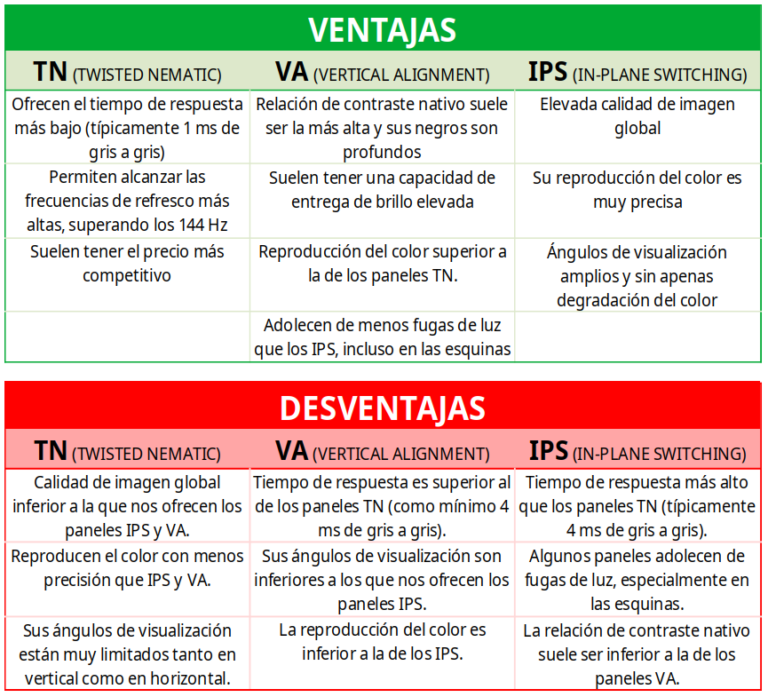
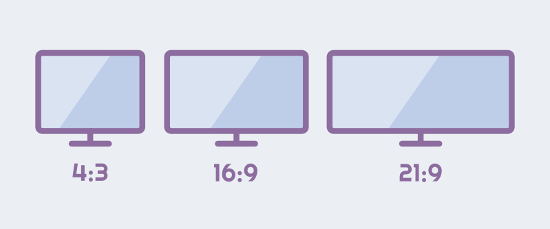
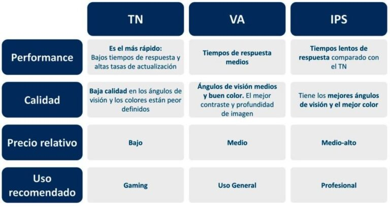
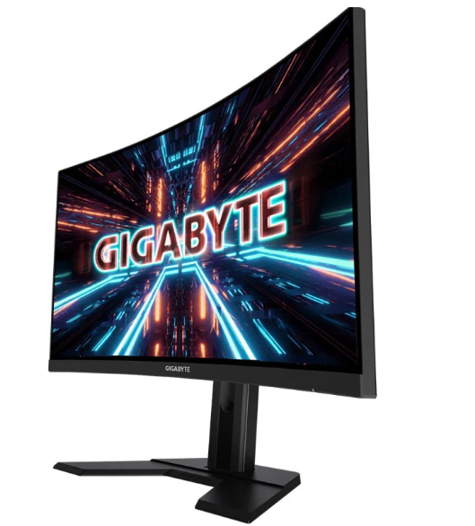

## BEFORE CHOOSING A MONITOR
When choosing a monitor, it's important to consider several aspects to ensure an optimal viewing experience. It's worth noting that the machine you intend to use with the monitor should be compatible with the screen's resolution you choose.

>Example: If you buy a 4K monitor but have a low-power PC, you won't get the most out of your monitor.

## ASPECTS TO CONSIDER
>RES

>PANEL TYPE

>REFRESH RATE

| Refresh Rate | Description                                    |
|--------------|------------------------------------------------|
| 60Hz         | Common standard, suitable for general tasks     |
| 75Hz         | Smoother display                                |
| 120Hz        | Significant improvement in gaming and multimedia content |
| 144Hz        | Ultra-smooth gaming experience                  |
| 240Hz        | Ideal for high-speed gaming and competition     |

>SIZE

>ASPECT RATIO

## Highlighted Examples of Monitors for Each Need:

 💻 **For PC Gaming:**

- **Resolution:** Minimum 1920x1080 (Full HD), preferably 2560x1440 (Quad HD), or 3840x2160 (Ultra HD / 4K).
  
- **Refresh Rate:** Minimum 144Hz for a smooth experience, preferably 240Hz or higher for fast-paced games.
  
- **Response Time:** 1ms or 2ms to avoid motion blur in intense games.

  1) [Gigabyte G27QC 27" LED QuadHD 165Hz Curved](https://www.pccomponentes.com/gigabyte-g27qc-27-led-quadhd-165hz-curva)

  2) [ASUS TUF Gaming VG27AQZ 27" LED IPS WQHD 165Hz G-Sync Compatible](https://www.pccomponentes.com/asus-tuf-gaming-vg27aqz-27-led-ips-wqhd-165hz-g-sync-compatible)

  
🎮 **For Console (General):**

- **Size:** 16:9
- **Refresh Rate:** 60-144 Hz
- **Technologies:** FreeSync (AMD)
- **Response Time (time it takes for a pixel to react) and input lag (time it takes for the monitor to react when the image enters)**

- 🎮 PS5 
  - **Sync Technology:** HDMI 2.1 compatible to fully leverage PS5 capabilities, including 4K at 120Hz and Variable Refresh Rate (VRR) technology.

  [GIGABYTE AORUS](https://www.pccomponentes.com/gigabyte-aorus-fv43u-43-qled-ultrahd-4k-144hz-usb-c)

- 🎮 Xbox
- **Requirements 1080x1920/30hz/27HZ/27"**

- 🎮 Nintendo
- **Requirements 1080x1920/30hz/27HZ/27"/IPS** 

📊 **For Work:** 
  
- [Philips 243V7QDSB 23.8" LED IPS FullHD 75Hz](https://www.pccomponentes.com/philips-243v7qdsb-238-led-ips-fullhd-75hz)

